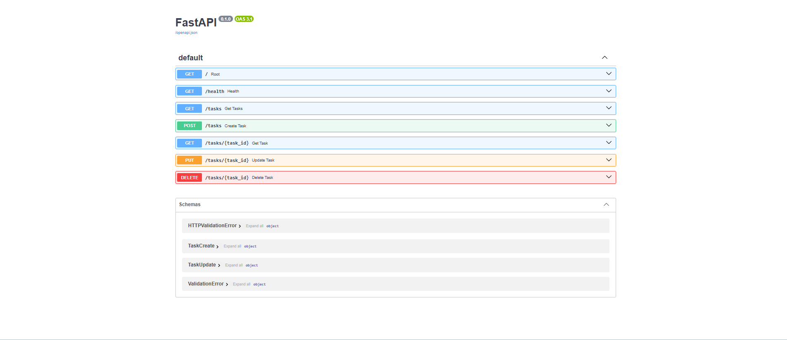

# Task API

A simple CRUD API for managing a to-do list, built with FastAPI. Tasks are stored in memory (no database) - data resets when the server restarts.

## How to run

1. Install dependencies: pip install fastapi uvicorn
2. Start the server: uvicorn main:app --reload
3. Visit http://localhost:8000/docs for interactive API docs.

## Endpoints

| Method | Path | Description |
|--------|------|-------------|
| GET | / | API info |
| GET | /health | Health check |
| GET | /tasks | List all tasks |
| GET | /tasks/{id} | Get one task |
| POST | /tasks | Create a task |
| PUT | /tasks/{id} | Update a task |
| DELETE | /tasks/{id} | Delete a task |

## Example request

curl -i -X POST http://localhost:8000/tasks -H "Content-Type: application/json" -d "{\"title\":\"Buy milk\"}"

Response:

HTTP/1.1 201 Created
content-type: application/json

{"id":5,"title":"Buy milk","done":false}

## Swagger UI

Screenshot of /docs showing all endpoints:

